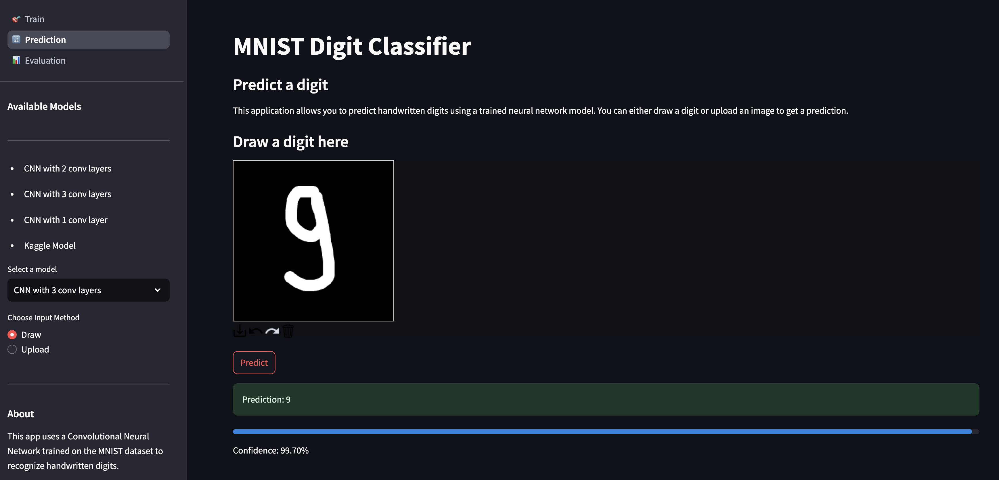

# 🔢 MNIST Digit Classifier

Interactive web app to recognize handwritten digits using a PyTorch CNN.

---

## 🚀 Project Overview

**What it does:**  
Predicts handwritten digits (0–9) from images using a neural network trained on the MNIST dataset.

Input: 28x28 image (1 channel = grayscale)
Output: digit from 0 to 9

---

## 🛠 Technologies Used

- **Language:** Python
- **Libraries:** PyTorch, Torchvision, Matplotlib, NumPy, Streamlit (for UI)
- **Development:** HuggingFace space

---

## 🧠 Model Architecture

The project implements a Convolutional Neural Network (CNN) with the following features:
- Multiple layer configurations (1/2/3 layers)
- Convolutional layers with LeakyReLU activation
- Max pooling layers
- Fully connected layers
- Dropout for regularization

## 📊 Data Preprocessing

The MNIST dataset is preprocessed as follows:
- Images are normalized to [0, 1] range
- Resized to 28x28 pixels
- Converted to grayscale (1 channel)
- Image format conversion and validation

## 🧪 How to Run

1. Clone the repo  
2. Create and activate virtual environment:
   ```bash
   python -m venv venv
   source venv/bin/activate  # On Windows: venv\Scripts\activate
   ```
3. Install dependencies:
   ```bash
   pip install -r requirements.txt
   ```
4. Run the application:
   ```bash
   streamlit run app.py
   ```

---

## 📈 Model Performance

The model was evaluated on the MNIST test dataset with impressive results.

### 3-Layer CNN Performance


The 3-layer CNN architecture achieves high accuracy with minimal loss, demonstrating effective learning across all digit classes.

### Kaggle Model Performance


This model was trained on the MNIST dataset from Kaggle. It shows excellent performance metrics with high accuracy across all digit classes.

---

## 👁️ Visualizations

### Prediction Examples

The model accurately identifies handwritten digits with confidence scores:


*Prediction of digit 4 with associated confidence scores*


*Prediction of digit 9 with associated confidence scores*

### Feature Visualization

Convolutional layer activations show what features the model focuses on when making predictions:


*Activation heatmap of the first convolutional layer when processing digit 4*


*Activation heatmap of the first convolutional layer when processing digit 9*

The heatmaps demonstrate how the model focuses on distinctive features of each digit to make accurate classifications.

---

## 🔍 Usage Examples

1. **Draw a digit**: Use the drawing pad to sketch any digit from 0-9
2. **Upload an image**: Alternatively, upload an image of a handwritten digit
3. **View prediction**: See the model's prediction along with confidence scores
4. **Explore visualizations**: View the activation maps to understand how the model "sees" the digit

---
